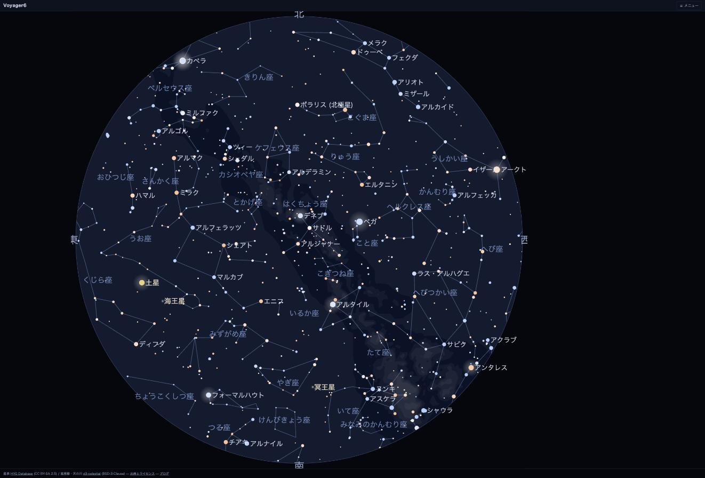

# Voyager6 — 天文情報サイト

ブラウザだけで動く星座早見を軸にした天文情報サイト。<https://voyager6.net>

天文計算はすべてブラウザ内で行い、外部 API を呼びません。ページは静的で、外部リソースを
一切読まないので `file://` で直接開いてもオフラインで動きます。
**LLM やチャット UI は組み込みません**。このサイトは「呼ばれる側の道具」に徹し、
AI からの引用・ディープリンク生成・データ参照を歓迎します。



## ページ

公開しているのは 16 ページです（`src/pages/` の 17 ファイルから `404.html` を除いたもの）。
並びと文言は [`src/llms.txt`](src/llms.txt) の Pages 節に揃えてあります。

| URL | ページ |
|---|---|
| [`/`](https://voyager6.net/) | **星座早見** — 指定日時・地点の全天。恒星10等まで、星座線、天の川、惑星・月、彗星、小惑星、メシエ天体。ホイールで拡大すると望遠鏡ファインダーになる |
| [`/solar/`](https://voyager6.net/solar/) | **太陽系3D** — 惑星・全既知彗星・小惑星の軌道を俯瞰。力学群フィルタ、木星固定、探査機25機、WebXR |
| [`/earth/`](https://voyager6.net/earth/) | **地球周回3D** — 人工衛星（TLE→SGP4）を地球中心で。月を正面から（満ち欠け・月食）、日食の影 |
| [`/comets/`](https://voyager6.net/comets/) | **彗星カタログ** — 符号・和名・英名で検索、近日点通過/周期で並べ替え |
| [`/asteroids/`](https://voyager6.net/asteroids/) | **小惑星カタログ** — 探査機が訪れた小惑星を軸に検索 |
| [`/variables/`](https://voyager6.net/variables/) | **変光星カタログ** — 眼視〜双眼鏡で追える約3,600個（GCVS由来）。「今夜見える」「極大が近い」で絞り込み |
| [`/tonight/`](https://voyager6.net/tonight/) | **今夜の空** — 日の入り・薄明・月・見ごろの惑星 |
| [`/calendar/`](https://voyager6.net/calendar/) | **天文現象カレンダー** — 月相・惑星・流星群・日月食（月明かり条件つき） |
| [`/eclipses/`](https://voyager6.net/eclipses/) | **日食・月食カタログ** — 2021〜2040年。日食図・月食可視域図（概略）と「宇宙から見る」3Dへ |
| [`/perseids/`](https://voyager6.net/perseids/) | **流星群** — ペルセウス座流星群2026の出現数目安 |
| [`/log/`](https://voyager6.net/log/) | **観察記録シート** — 印刷して現地で使う記録用紙（スケッチ用・流星計数用） |
| [`/planetarium/`](https://voyager6.net/planetarium/) | **VRプラネタリウム** — 天球の内側に星空を描く没入ビュー（WebXR） |
| [`/ask/`](https://voyager6.net/ask/) | **AIに聞いてみる** — AI にこう頼めばリンクが返る、コピペ用の文例集 |
| [`/docs/`](https://voyager6.net/docs/) | **URLパラメータ仕様** — ディープリンクの全パラメータと動く例 |
| [`/credits/`](https://voyager6.net/credits/) | **出典とライセンス** |
| [`/embed/`](https://voyager6.net/embed/) | **Webページに埋め込む** — iframe で貼るための実例集。<br>※ 現状 `unlisted: true`（noindex・sitemap と llms.txt に非掲載）。docs からのリンクでのみ案内している |

ブログ <https://blog.voyager6.net/> は別ドメイン（WordPress）で、データ API は持ちません。

## 横断する4つの柱

ページごとの機能ではなく、サイト全体を貫く考え方です。

**URL がすべて。** 画面に出ている状態は、ほぼすべて URL で表せます。日時・観測地・視野・
反転・目標天体・表示レイヤ。リンクをコピーすれば他の端末で同じ画面が開きます。
**住所は変えない**のが原則で、一度配ったリンクは生かし続けます。
→ [`/docs/`](https://voyager6.net/docs/)

**紙に出せる。** 白地の印刷テーマ、日時・観測地・視野を刷り込んだヘッダ、クレジットの焼き込み、
SVG 単体出力。観測星図モードでは比較星に等級ラベル（小数点省略 8.4→`84`）が付きます。

**他人のページに貼れる。** `?embed=1` でヘッダ・パネルを消し、右下にクレジットバッジだけ出します。
Google マップを記事に貼るのと同じ要領です。→ [`/embed/`](https://voyager6.net/embed/)

**AI から呼べる。** [`/llms.txt`](src/llms.txt) にサイト説明と URL レシピを置き、
[`/data/index.json`](https://voyager6.net/data/index.json) に配信データの機械可読な索引
（出典・ライセンス・更新頻度・スキーマ込み）を置いています。
利用者はパラメータを覚えなくてよく、「〜のリンクを作って」と AI に頼めば済む、という設計です。

## 開発

```sh
python3 tools/build_data.py     # 星表・星座線・天の川・メシエ天体 → src/data.js（初回のみ約14MB DL）
python3 tools/build_events.py   # 日食・月食・流星群 → src/events.js
python3 tools/build_site.py     # src/ を結合して dist/ を出力
node --test tests/*.mjs         # テスト

python3 -m http.server 8765 --directory dist   # 手元で確認
```

`tools/build_og.py` は OGP 画像と favicon を作り直すときだけ使います（日本語フォントが要るので
CI では回さず、生成物 `src/og.png` / `src/favicon.svg` をコミットしています）。

`tools/build_stars_v1.py` は 20等星図の HEALPix タイル（Gaia DR3）を作ります。
全天ビルドは数百GBのダウンロードを伴うので手元で流し、`deploy/rsync-stars.sh` で配信サーバへ送ります。
配信サーバ（`data.voyager6.net`）の構築手順は [`deploy/README.md`](deploy/README.md)。

## 構成

```
src/
  astro.js       計算エンジン（座標変換・歳差・太陽・月・惑星）
  sky.js         出没・薄明・月齢・天文現象
  render.js      早見盤の描画
  stars.js       深い星表タイルのデコード（AT-HYG 10等 / Gaia HEALPix v1）
  sites.js       観測地プリセット（都市47 + 観望地5）
  dataurl.js     cron更新データの取得（data.voyager6.net 優先・不通なら同梱コピー）
  data.js        星表（build_data.py が生成。手で編集しない）
  events.js      食・流星群（build_events.py が生成）
  llms.txt       AI向けサイト説明（docs と並ぶ一次情報）
  layout.html    共通テンプレート / style.css / pages/*.html
tools/           ビルドスクリプト
deploy/          data.voyager6.net の nginx conf・cron・rsync・手順書
dist/            公開物（GitHub Actions が build して Pages に配信）
tests/           src/*.js を直接読むユニットテスト
```

## フォークとセルフホスト

**丸ごと自分のところで動かせます。** 特別な環境は要りません。

必要なもの:

- **Python 3**（標準ライブラリのみ。`pip install` は不要）
- **Node 22**（テストを走らせる場合のみ）
- 初回のデータ取得で約 **14MB**（星表）＋ 深い星表を作るなら AT-HYG の
  サブセットで数十MB。20等星図の全天ビルドだけは別格で、Gaia バルクの
  ダウンロードが数百GB・十時間規模になります（`--files all`、任意）

ビルドスクリプトの依存順:

```
build_data.py    ─┐
build_events.py  ─┼→ build_site.py → dist/
build_stars.py   ─┘   （build_comets.py / build_asteroids.py /
                        build_satellites.py の出力があれば取り込む）
```

`build_site.py` は、cron 更新系のデータ（彗星・小惑星・人工衛星）が**無ければ黙って飛ばします**。
まず `build_data.py` → `build_events.py` → `build_site.py` の3本だけで、
早見盤・カレンダー・今夜の空は動きます。

GitHub Actions は3本:

| ワークフロー | 起動 | 役割 |
|---|---|---|
| `deploy.yml` | push | ビルドして GitHub Pages へ配信 |
| `orbital-data.yml` | 週2（月・木） | 彗星・小惑星の軌道要素を MPC/JPL から取り直してコミット |
| `satellites-data.yml` | 日次 | 人工衛星の TLE を CelesTrak から取り直してコミット |

`data.voyager6.net`（配信サーバ）は **任意です**。無くてもサイトは動きます。
人工衛星のデータはまずそちらを見に行き、不通ならリポジトリ同梱のスナップショットに落ちます
（`src/dataurl.js`。`?data=0` で常にスナップショットを使わせることもできます）。

## 計算の精度

JPL Horizons と突き合わせて検証しています（`tests/`）。

| 対象 | 精度 | 検証方法 |
|---|---|---|
| 恒星 | 0.2° 未満（歳差補正あり） | Meeus の例題（GMST・座標変換・歳差） |
| 太陽 | 0.3° 未満 | JPL Horizons |
| 月 | 0.5° 未満（地平視差補正あり）※ | JPL Horizons |
| 惑星（水星〜土星） | 0.5° 未満 | JPL Horizons |
| 日の出入り・薄明 | 誤差 1分以内 | Horizons の1分刻み暦から求めた交差時刻 |
| 月の出入り | 誤差 3分以内 | 同上 |
| 新月・満月 | 数分 | NASA の食カタログ（日食＝新月、月食＝満月） |

※ 月の位置は **ELP2000-82B の主要項**（Meeus 第47章）で計算しており、
地球周回3D の月表示では JPL Horizons と 3秒角以内で一致します。
太陽・惑星は Schlyter の軌道要素＋木星・土星の主要摂動項。詳しくは
[`/credits/`](https://voyager6.net/credits/) の「使っている計算の出典」。

**日食の局地的な状況（食分・接触時刻）は扱いません。** 太陽の視直径 0.53° に対して
位置精度が足りず、意味のある値にならないためです。月食は地心現象なので、
「その瞬間に月が地平線上にあるか」で見える・見えないを判定しています。

## ライセンス — 三層に分かれます

| 層 | 対象 | ライセンス |
|---|---|---|
| **コード** | このリポジトリの自作コード | MIT |
| **画面と出力** | スクリーンショット・印刷・SVG 出力 | CC BY-SA 4.0（クレジット: voyager6.net） |
| **データ** | 星表・軌道要素・カタログ | 出典ごとに異なる → [`/credits/`](https://voyager6.net/credits/) |

画面と出力は **CC BY-SA 4.0** です。教育・報道・出版・放送での利用を歓迎します。

**ただし例外が一つあります。視野 2° 未満まで拡大すると、20等までの深層として
ESA の Gaia DR3（[CC BY-NC 3.0 IGO](https://creativecommons.org/licenses/by-nc/3.0/igo/)）が
加わります。CC BY-NC は CC BY-SA と混ぜられないため、その図の再利用は非商用に限られます。**
印刷と SVG 出力の隅に自動でその旨が表示されます。
逆に視野 2° 以上（観測星図の既定 6° を含む）は AT-HYG だけで描かれるので、
CC BY-SA 4.0 のまま商用も含めて自由に使えます。商用利用が前提なら `fov` を 2 以上にしてください。

`src/data.js` は HYG Database 由来のため **CC BY-SA 2.5 を継承**します（コードの MIT とは別）。

## AIアシスタント向け / For AI assistants

- **ディープリンク生成**：早見盤 `?t=YYYY-MM-DDTHH:MM&lat=&lon=`（望遠鏡視野は `&z=&ra=&dec=&flip=`）、太陽系3D `/solar/?date=&comet=&ael=` で、特定の空・軌道ビューへの直接リンクを作れます。全パラメータと動く例は [`/docs/`](https://voyager6.net/docs/)。
- **データ参照**：全既知彗星・命名済み/地球近傍小惑星の軌道要素を、CORS対応（`Access-Control-Allow-Origin: *`）の安定JSONで配信。機械可読な索引は [`/data/index.json`](https://voyager6.net/data/index.json)（出典・ライセンス・スキーマ込み）。出典 IAU MPC / JPL SBDB、出力は CC BY-SA 4.0。
- **方針**：LLMやチャットUIは組み込まず「呼ばれる側の道具」に徹する。サイト全体の説明は [`/llms.txt`](https://voyager6.net/llms.txt)。AIによる引用・リンク生成・データ参照を歓迎します。

## なぜフォークできる形にしてあるか

このサイトは個人が作っています。**作者が続けられなくなっても、地図は残ってほしい。**

だから外部 API に依存せず、データは出典ごとにライセンスを明示し、ビルドは標準ライブラリだけで
完結するようにしてあります。リポジトリを clone して `build_site.py` を走らせれば、
誰の許可も要らずに同じものが立ち上がります。配信サーバも任意です。

変更の履歴は [CHANGELOG.md](CHANGELOG.md)。仕様の一次情報は
[`/docs/`](https://voyager6.net/docs/) と [`src/llms.txt`](src/llms.txt) で、
この README はその要約です。
